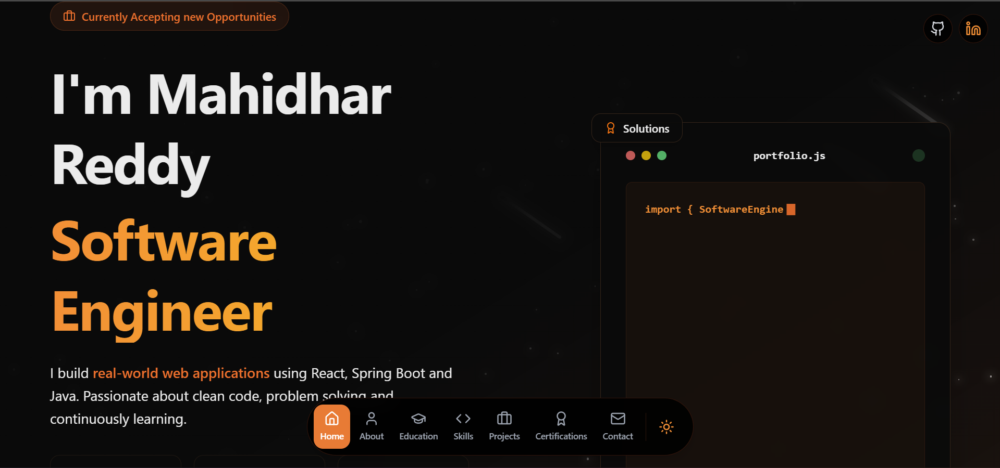
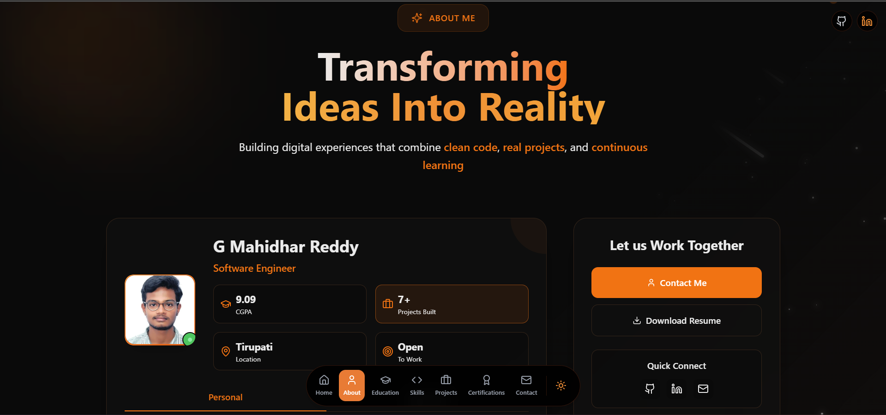
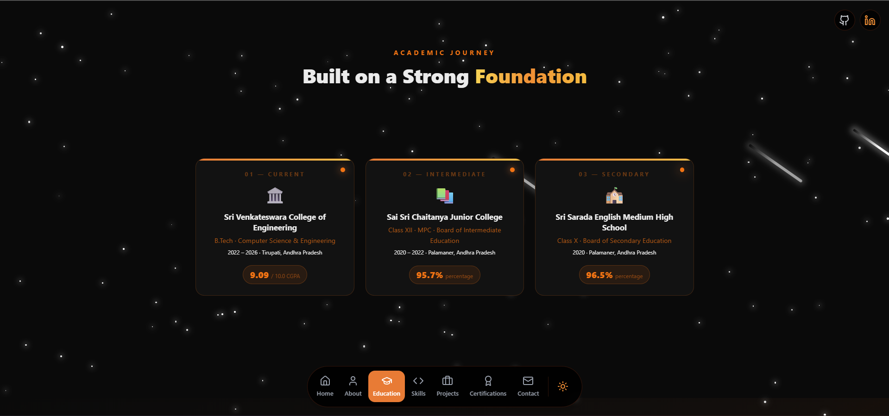
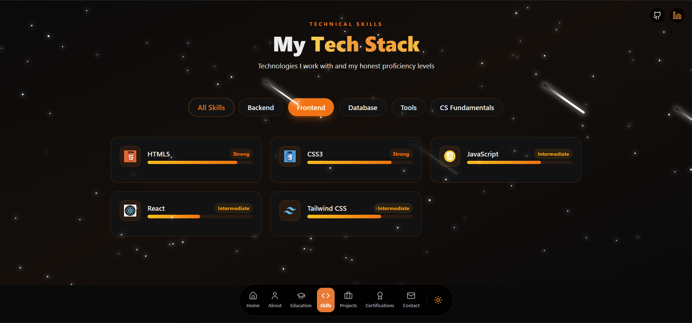
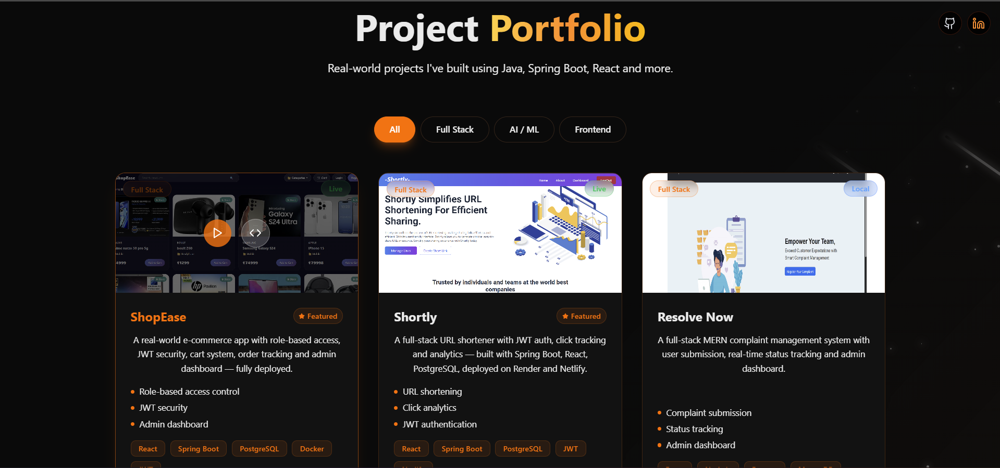
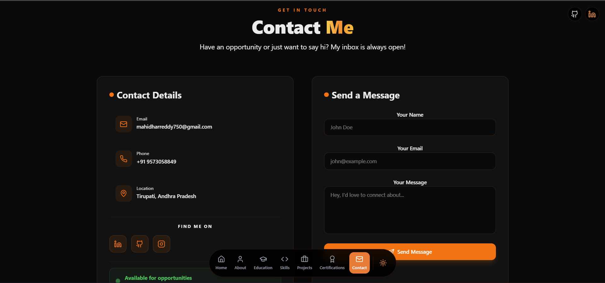
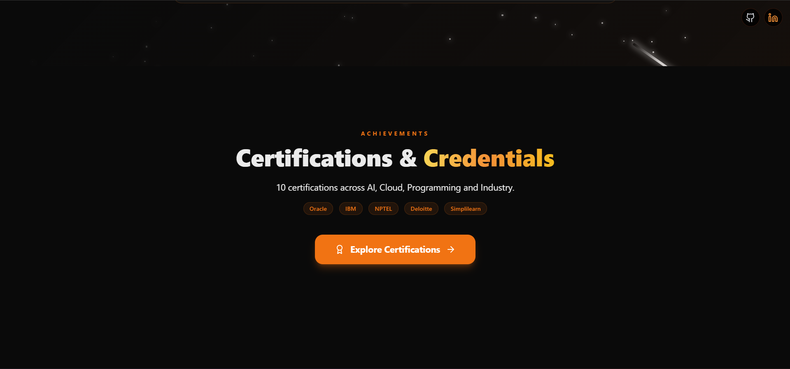

# 🚀 G Mahidhar Reddy — Developer Portfolio

<div align="center">
  <br />
  <div>
    
    
    
    
    
    
  </div>
  <h3 align="center">Personal Portfolio of G Mahidhar Reddy | Software Engineer</h3>
  <div align="center">
    <a href="https://www.linkedin.com/in/g-mahidhar-reddy/" target="_blank"><b>LinkedIn</b></a> •
    <a href="https://github.com/Mahidhar-git" target="_blank"><b>GitHub</b></a> •
    <a href="mailto:mahidharreddy750@gmail.com"><b>Email</b></a>
  </div>
  <br />
</div>

---

## 📸 Screenshots

### 🏠 Home Page



### 🧰 Other Sections






---

## ✨ Features

- 🌑 **Dark / Light Mode** — Dark by default with toggle
- 🎓 **Education Section** — Interactive explosion animation
- 📜 **Certifications Page** — Scroll-based stacked card experience
- 💼 **Projects Showcase** — 7 real projects with live demos
- 🛠️ **Skills Section** — Infinite scroll with real tech stack
- 📩 **Contact Form** — Working form with Formspree
- 📱 **Fully Responsive** — Mobile first design

---

## ⚙️ Tech Stack

| Layer | Technologies |
|---|---|
| **Frontend** | React, Tailwind CSS, Framer Motion, Vite |
| **Backend** | Java, Spring Boot, REST APIs, JWT |
| **Database** | MySQL, PostgreSQL, MongoDB |
| **Tools** | Git, GitHub, Docker, Postman, IntelliJ |

---

## 👌 Quick Start

### Prerequisites
- [Node.js](https://nodejs.org/)
- [Git](https://git-scm.com/)

### Clone and Run
```bash
git clone https://github.com/Mahidhar-git/React-Portfolio.git
cd React-Portfolio/client
npm install
npm run dev
```

App runs at: [http://localhost:5173](http://localhost:5173)

---

## 🏗️ Build for Production
```bash
cd client
npm run build
```

---

## ☁️ Deployment — Netlify

1. Push code to GitHub
2. Go to [netlify.com](https://netlify.com)
3. Import repository
4. Set **Base directory:** `client`
5. Set **Build command:** `npm run build`
6. Set **Publish directory:** `client/dist`
7. Click **Deploy!**

---

## 📬 Contact

| Platform | Link |
|---|---|
| 📧 Email | mahidharreddy750@gmail.com |
| 💼 LinkedIn | [g-mahidhar-reddy](https://www.linkedin.com/in/g-mahidhar-reddy/) |
| 🐙 GitHub | [Mahidhar-git](https://github.com/Mahidhar-git) |
| 📸 Instagram | [mahidharreddy750](https://www.instagram.com/mahidharreddy750/) |
| 📱 Phone | +91 9573058849 |

---

<div align="center">
  <p>Built with ❤️ by <b>G Mahidhar Reddy</b></p>
  <p>© 2026 All rights reserved</p>
</div>